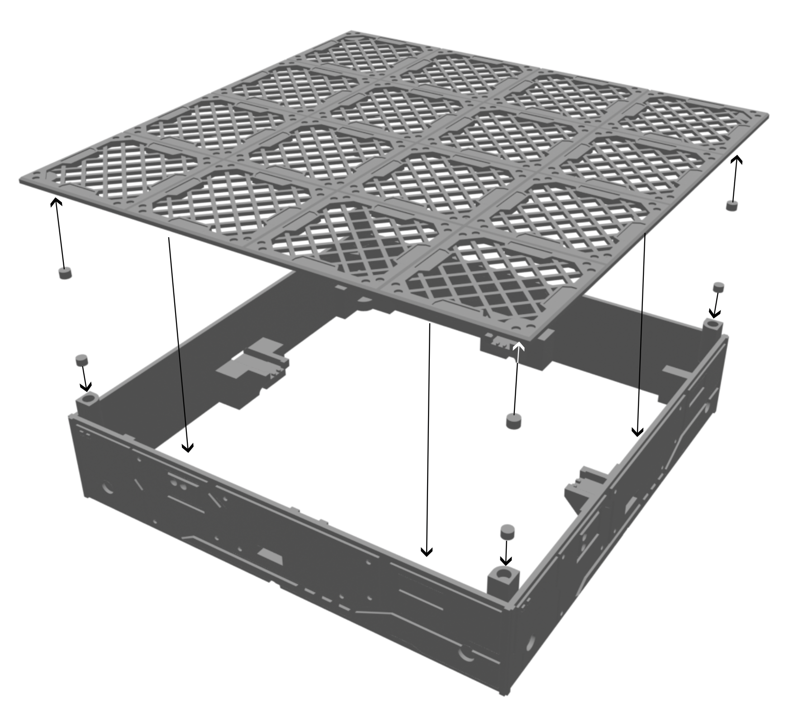

# STL files for the 4x4 RGB TCP client
STL files for the 4x4 TCP client.
Print at 140mm x 140mm.
Use magnets glued to the underside of the 'lid" section - 3mm x 0.5mm neodymium magnets.
Place the populated circuit board inside the main body and a rounded "corner pillar" in each corner. Glue a 3mm x 2mm neodymium magnet inside each pillar, such that the lid is attracted to it.

